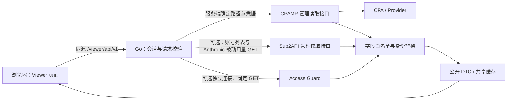

# 架构说明

本文描述 Viewer 2.5.0 的源码结构、数据流和扩展边界。前端上游来源及选择性移植范围见 [UPSTREAM_BASELINE.md](UPSTREAM_BASELINE.md) 和 [web-cpamp/UPSTREAM.md](../web-cpamp/UPSTREAM.md)，协作和验证流程见 [CONTRIBUTING.md](../CONTRIBUTING.md)。

## 1. 运行组成

Viewer 是独立的 Go HTTP 服务，向浏览器提供 React 页面和经过筛选的数据。它通过服务端配置连接 CPA Manager Plus（CPAMP），可额外连接 Sub2API 读取账号额度；不直接读取上游数据库文件，也不接管管理界面。

| 目录或文件 | 职责 |
| --- | --- |
| `server/main.go` | 加载配置、嵌入前端资源、启动 HTTP 服务及处理退出信号 |
| `server/internal/config/` | 环境变量、密钥文件引用、访问模式与 Access Guard 公开范围校验 |
| `server/internal/auth/` | Viewer 密码验证、会话签名、有效会话登记及注销 |
| `server/internal/cpamp/` | 携服务端 Admin Key 请求 CPAMP，限制超时、响应大小和重定向 |
| `server/internal/sub2api/` | 携服务端管理员密钥读取 Sub2API 固定接口，解包响应并限制超时、响应大小和重定向 |
| `server/internal/accessguard/` | 只访问固定 Access Guard 读取接口的客户端 |
| `server/internal/httpapi/` | 固定 Viewer 路由、请求校验、公开 DTO 投影及共享缓存 |
| `web-cpamp/src/viewer/` | Viewer 路由、登录、页面、API 客户端、数据 hook 与适配器 |
| `web-cpamp/src/features/` | 保留的 CPAMP 组件及纯展示、统计模型；是否进入生产应用取决于实际导入链 |
| `server/webdist/` | 前端构建输出，由 Go 编译时嵌入 |
| `tests/mock-cpamp/` | 受控的上游接口测试夹具 |
| `scripts/build-release.sh`、`Dockerfile` | 固定工具链构建、检查与产物打包 |

Viewer 本身没有业务数据库。会话有效性登记和各类查询缓存位于进程内；业务历史、模型价格、凭据及插件状态仍由上游保存。服务重启会丢弃这些内存状态。

## 2. 生产前端与嵌入构建

生产前端是 `web-cpamp/`。入口链为 `src/main.tsx` → `src/App.tsx` → `src/viewer/ViewerApp.tsx`。`AppLifecycle` 只初始化主题、语言和视觉效果等界面状态。

`web-cpamp/vite.config.ts` 将静态资源基址设为 `/viewer/`，普通构建输出到 `server/webdist/`。`server/main.go` 的 `//go:embed webdist` 随 Go 编译嵌入这些文件，因此修改前端后必须先重建前端，再重建 Go 二进制。仅修改 TSX 不会改变已有二进制内的页面。演示模式有单独的 `dist-demo/` 输出，不是生产嵌入目录。

服务端通过 `/management.html` 提供入口 HTML，通过 `/viewer/` 提供静态资源；根路径重定向到入口。页面使用 `HashRouter`，当前有六个功能路由：

| Hash 路径 | 页面 |
| --- | --- |
| `/` | 仪表盘 |
| `/usage-analytics` | 用量分析 |
| `/monitoring` | 请求监控 |
| `/quota` | 账户额度 |
| `/key-quota` | 公开 Access Guard Key 额度 |
| `/usage-status` | 用量存储与归档状态 |

`Dockerfile` 先用固定 Node 镜像构建前端，再用固定 Go 镜像编译静态二进制，最后放入非 root 的运行镜像。`scripts/build-release.sh` 还包含类型检查、测试、成品前端管理能力扫描及跨平台打包；源码发布与运行镜像发布是独立动作。

## 3. 请求流与只读边界

浏览器只使用 `web-cpamp/src/viewer/api/client.ts` 中的固定同源 API，不接收 CPAMP Admin Key、Sub2API 管理员密钥、CPA Management Key 或 Provider Token。上游地址、方法、请求头和凭据选择由服务端代码控制。公开 API 没有任意 URL 代理或任意管理接口转发能力。

只读指不允许修改上游配置、凭据、额度或历史数据，并不要求所有查询都使用 HTTP GET。统计筛选使用 POST 携带查询条件；非 Codex 额度快照也使用固定 POST 查询。Codex 额度读取使用 CPA 的 POST 包装接口，但包装内的方法固定为 GET。登录、注销只影响 Viewer 自己的会话。

路由注册位于 `server/internal/httpapi/server.go`。以下路径均相对 `/viewer/api/v1`：

| 方法 | 路径 | 功能 |
| --- | --- | --- |
| GET | `/session` | 返回 Viewer 访问模式和当前会话状态 |
| POST | `/login`、`/logout` | Viewer 密码登录、注销 |
| GET | `/dashboard` | 组合仪表盘摘要、运行信息和公开统计 |
| GET | `/maintenance` | 页面维护提示所需的只读状态 |
| GET | `/aliases` | 当前可用 Key 的公开别名和替代 ID |
| GET | `/model-prices` | 经筛选的价格数据，用于显示与计算 |
| GET | `/model-price-status` | 模型价格缺失提醒 |
| POST | `/analytics` | 受限的统计、筛选、分页和下钻查询 |
| GET | `/quota` | 服务端确定账户的额度视图 |
| GET | `/access-guard/quotas` | 管理员显式选择公开的插件额度 |
| GET | `/usage-status` | 用量记录、归档、存储占用和就绪状态 |

独立的 `/health` 检查 Viewer 与 CPAMP 的连接状态。额度和状态等专用查询接口拒绝浏览器指定查询参数或请求体；新增能力应沿用独立路由和明确数据结构。

服务端同时设置 CSP、禁止页面嵌入、禁止 MIME 嗅探等响应头。CPAMP 客户端禁止自动跟随重定向，限制响应大小，且不保留上游非成功响应的原始错误正文，避免凭据回显或内部诊断进入公开错误信息。

### DTO 与身份替换

公开数据通过明确的 Go 结构体或 `analyticsFields`、`analyticsChildren` 白名单投影。未知字段不会因为上游新增而自动暴露。文本和 URL 还会经过长度限制、敏感内容过滤和查询部分清理。

身份字段使用 `view_` 加 12 位十六进制字符的替代 ID。通用实现是对原值取 SHA-256 后截取前 6 字节；它用于关联展示与筛选，不是授权令牌，也不应描述为不可推断的加密身份。经过筛选的显示名称与别名可以公开，因此“使用替代 ID”不意味着隐藏所有账户名称。

原始 API Key、Key 哈希、内部凭据索引、账户主体标识、请求会话标识、访问令牌哈希、客户端 IP、User-Agent、Trace、原始响应 metadata 和凭据正文不属于公开 DTO。前端的脱敏显示开关不是权限边界：没有获得许可的字段必须在服务端就被排除。

`viewer/model/viewerUsageAnalyticsAdapter.ts` 会把公开字段改名为共享组件预期的字段，例如将公开 Key ID 适配到 `api_key_hash` 位置，但值仍是 `view_*`。扩展适配器不能恢复原始身份或绕过服务端投影。

## 4. 公开访问与密码会话

`VIEWER_PUBLIC_ACCESS` 默认是 `true`。公开模式的 `/session` 返回已认证和公开访问标志，不要求访客登录；这是发布整个公开 DTO 的选择，不是按 Key 或按账户划分的多租户权限系统。非 GET/HEAD 数据查询仍经过 Origin 检查。

设置 `VIEWER_PUBLIC_ACCESS=false` 时，需要配置 Viewer 密码。密码模式使用 `cpamp_viewer_session` Cookie：会话内容经过 HMAC-SHA256 签名，包含随机 ID、过期时间和 CSRF Token；Cookie 设置 `HttpOnly` 和 `SameSite=Strict`，`Secure` 由 `VIEWER_SECURE_COOKIES` 控制。默认会话时长为 12 小时。

有效会话还必须存在于进程内登记表，注销会撤销登记。因此即使保持会话签名密钥不变，进程重启仍会使密码会话失效；多实例部署也不能仅靠共享签名密钥实现共享会话。

前端将 CSRF Token 保存在模块内存中，非 GET/HEAD 请求通过 `X-CSRF-Token` 发送。服务端在密码模式下校验 Cookie、有效登记和 CSRF。当前 Origin 校验在请求携带 `Origin` 时比较其 host 与请求 host；不带 `Origin` 的请求可通过该项检查，它本身不是访问身份认证。

服务端密钥可通过环境变量或对应的 `_FILE` 引用加载。`VIEWER_SESSION_SECRET` 未设置时会生成进程随机密钥；该密钥也参与分页游标加密。密钥值不应进入前端构建变量、示例响应或源码。

## 5. Analytics：受限筛选、游标与数据覆盖

`POST /analytics` 经 `validateAnalytics` 校验后，才会调用固定上游 `/v0/management/monitoring/analytics`。顶层字段、筛选字段及 `include` 项都有白名单。时间范围、数组长度、搜索文本、布尔值、分页数量等也有限制；默认最大时间范围为 366 天，事件页默认上限为 200，公开事件页硬上限为 500。服务端最多同时处理 4 个 analytics 请求，超出返回 429。

身份类筛选只接受 `view_*`。即使兼容字段名仍叫 `api_key_hashes`、`auth_indices` 或 `auth_files`，浏览器也不能提交对应的原始值。服务端通过别名和当前查询范围的筛选元数据建立映射，解析成上游身份后请求；无法解析的身份被拒绝。

别名读取分为两个用途：独立 `/aliases` 列表只显示当前 CPA 配置中仍存在的 Key；历史统计行使用上游保存的完整别名历史，以免删除 Key 后历史记录失去名称。

事件分页只接收 Viewer 生成的游标。游标用 AES-GCM 加密和认证上游的时间与行 ID，密钥由会话密钥派生。上游返回的 `next_cursor` 会被丢弃，内部行 ID 不直接传给浏览器。公开结果如果被本地截断，也会移除不再适用于该页尾的游标，避免跳过记录。

`usage_coverage.go` 投影的是数据覆盖信息：当前时间范围、对比范围和辅助范围内是否缺失原始事件，以及是否仍能使用聚合数据。它严格接受已知枚举、布尔值、浏览器可精确表示的非负整数和有限的辅助范围。未知限制文案会转成固定通用标志，不公开诊断文本。

`useViewerAnalytics` 为成功响应记录 `responseRequestKey`。只有响应属于当前请求、且查询启用时，才单独返回 `coverage`；旧统计快照可保留，但切换筛选范围期间或新范围查询失败后不会复用旧范围的覆盖提醒。用量分析和请求监控消费这个独立字段，而不是直接读取旧 `data.coverage`。

## 6. 额度查询

`GET /quota` 的 CPAMP 账户列表来自服务端读取的 auth-file 元数据，浏览器不能指定账户、凭据、上游地址或请求头。处理器同时组织完整 Codex 查询、非 Codex 已保存快照和请求头观测，最后生成统一的账户与窗口 DTO。配置 Sub2API 后，服务端并行读取两个来源并在同一响应中合并账号，逐账号保留 `source` 标识；单侧读取失败时返回另一侧数据和通用提示。

### Sub2API 被动额度

`sub2api_quota.go` 读取分页 `/api/v1/admin/accounts`。仅对 Anthropic OAuth/Setup Token 账号以最多 8 个并发 GET 请求固定的 `/api/v1/admin/accounts/:id/usage?source=passive`；OpenAI Codex 则从账号列表 `extra` 中投影已有的 5H/7D 用量、时长和重置时间，丢弃空时长与已过期窗口。其他账号只显示明确配置的额度，不请求不受支持的被动接口，也不使用可能触发主动探测的批量接口。仅把名称、平台、套餐、状态及可确认的额度窗口投影到现有 DTO；原始凭据、账号 ID 和上游错误正文不公开。缺失使用率保持 `null`，最多处理 2000 个账号，超出时该来源整体标记不可用而非静默截断。两套管理员密钥分别配置，不互相复用。

### Codex 完整额度

`codex_live.go` 通过既有 CPAMP 连接调用固定 `/v0/management/api-call`，包装内容固定为 `GET https://chatgpt.com/backend-api/wham/usage`。服务端选择 auth index 和经过校验的账户标识；CPA 用所选凭据替换授权占位符。浏览器不取得 Token，也不能把该机制用于其他目标。

`codex_usage.go` 解析完整响应中的普通额度、Spark、代码审查及其他可识别窗口。成功的完整结果会替换全部被动窗口，包括合法的空窗口列表；不能把旧 Spark 镜像或未知窗口再拼回去。窗口保留实际时长、重置时间和观测时间，不凭套餐名推断 5 小时或 7 天窗口，缺失使用率也不能变成“剩余 100%”。

完整查询使用 60 秒共享缓存，同一轮刷新最多并行查询 4 个账户，单账户最多 10 秒，整轮最多 20 秒。访客取消可以停止自己的等待，不会取消其他访客共用的后台刷新。更新失败时保留可用的上次结果并标为陈旧；没有完整结果时依次使用凭据元数据中的额度信号和历史请求头观测，并说明来源。

### 非 Codex 已保存快照

`quota_snapshots.go` 向固定 `/v0/management/quota-snapshots/query` 发起只读 POST，账户参数只由可信 auth-file 元数据构造，单批最多 200 个账户，使用 60 秒共享缓存，后台刷新最多 5 秒。返回项必须匹配本批的账户标识和 Provider。这里读取 CPAMP 已保存的额度快照，不启动 Provider 凭据交换或快照写入。

有效快照优先于对应 Provider 的请求头观测；合法空结果清除旧窗口，读取失败可保留上次成功结果并标记陈旧。百分比缺失以 `null` 表示，窗口保留实际重置时间、模型范围和观测时间。整个 `/quota` 请求有 28 秒预算，被动请求头读取单独限制在 3 秒内。

### Access Guard 显式公开范围

Access Guard 发布默认关闭，与 Viewer 默认公开访问是两个不同设置。必须显式配置以下一种选择：

- `ACCESS_GUARD_PUBLIC_KEYS` 或 `ACCESS_GUARD_PUBLIC_KEYS_FILE`：用 `binding_id` 和公开 `name` 指定允许展示的绑定。
- `ACCESS_GUARD_PUBLIC_ALL=true`：显式公开插件返回的全部绑定。

两种选择互斥，内联配置与文件配置也互斥。只设置连接信息、没有公开选择会被拒绝。只配置公开范围时复用 CPAMP 的插件代理；独立连接则需要 `ACCESS_GUARD_BASE_URL` 和独立管理密钥。复用 CPAMP 意味着向 CPAMP 认证，再由其已保存的 CPA 连接代理，不是把 CPAMP Admin Key 当作 CPA Management Key。

插件客户端只读取 `/v0/management/plugins/access-guard/native-key-bindings`。`access_guard.go` 只发布公开名称、替代 ID、状态、周限额、剩余金额、剩余比例及周期信息；不发布原始 Key、绑定 ID、凭据限制或管理控件。公开条目 ID 由公开顺序槽位生成，不直接散列可预测的管理绑定 ID。

该接口使用 15 秒共享缓存与失败重试冷却，只缓存公开 DTO。读取失败时可显示陈旧成功快照。前端仅在页面可见时每 30 秒刷新，并合并重复刷新。当前 Access Guard 发起者在独立超时上下文中同步执行共享读取，后续等待者可取消等待；其取消机制与 Codex 后台刷新不同。

## 7. 运行元数据与兼容处理

`GET /usage-status` 只读取固定上游 `/v0/management/usage/maintenance`，校验结构后发布计数、可选时间戳、存储字节数、就绪布尔值和已知操作状态。数据库路径、归档文件、运行标识、锁详情和错误诊断不进入公开响应。它使用 30 秒共享缓存、最多 5 秒读取预算、失败冷却和陈旧成功结果保留。HTTP 成功状态不等于结构可用：旧上游缺少接口或返回不同结构时，公开结果是 `available:false`。

`GET /model-price-status` 以类似方式读取固定的模型价格状态，使用 60 秒共享缓存，发布有界的模型名称列表和计数。页面可以提醒价格缺失，但不会引入价格编辑或同步操作。

这些状态描述上游现状，不授予维护权限。归档创建、验证、删除原始行、压缩、导入、导出和更新操作仍属于原始管理应用。局部信息缺失应保持未知或不可用；旧接口兼容不能制造已观测的响应模型、服务等级、额度或覆盖完整性。

## 8. 新功能从哪里接入

| 修改目标 | 主要入口 |
| --- | --- |
| 页面路由、导航 | `viewer/ViewerApp.tsx`、`viewer/ViewerLayout.tsx` |
| 公开请求契约 | `viewer/api/client.ts`、`viewer/api/types.ts`；部分页面还使用 `viewer/model/viewerTypes.ts` |
| 仪表盘 | `ViewerDashboardPage.tsx`、`ViewerDashboardPage.model.ts` 与服务端 dashboard 投影 |
| 用量分析 | `ViewerUsageAnalyticsPage.tsx` → 注入 `useViewerUsageAnalytics` → `UsageAnalyticsSurface.tsx` |
| 请求监控 | `ViewerMonitoringPage.tsx`、`viewer/model/monitoring.ts`、`monitoringPage.ts` 与共享监控展示组件 |
| 账户额度 | `ViewerQuotaPage.tsx`、`viewer/model/viewerQuota.ts` 与服务端 quota 模块 |
| Key 额度 | `ViewerKeyQuotaPage.tsx`、`useViewerKeyQuotas.ts`、`access_guard.go` |
| 用量状态 | `ViewerUsageStatusPage.tsx`、`useViewerUsageStatus.ts`、`usage_status.go` |

表内前端路径相对 `web-cpamp/src/`，页面文件位于 `viewer/pages/`，hook 文件位于 `viewer/hooks/`；后端模块位于 `server/internal/httpapi/`。

增加字段时，应先明确公开 DTO 和上游固定读取方式，再更新请求校验、字段投影、相关 TS 类型、Viewer 适配器和展示。两套 Viewer 类型有重叠时需要同步检查。上游已经规范化的 analytics Token 直接用于统计，不再次应用原始 Provider 的缓存 Token 归一化。

共享组件应接收数据或注入 Viewer hook。保持 `useThemeStore`、`useNotificationStore` 等必要 store 的直接导入，避免 `@/stores` 汇总导出带入管理认证、配置或额度 store。不要将原始管理 Page、管理 hook、`ModelPriceAttentionLink` 或任意 API 客户端直接接到 Viewer 路由上。

验证重点是可观察行为与边界：非法筛选被拒绝、原始身份不出现在响应或产物、分页不丢记录、请求范围切换不沿用旧 coverage、合法空额度能清除旧窗口、失败不会伪装成零用量或完整额度。共享 UI 升级还应检查实际生产导入链与构建产物；仅确认按钮不可见不足以证明只读隔离成立。
